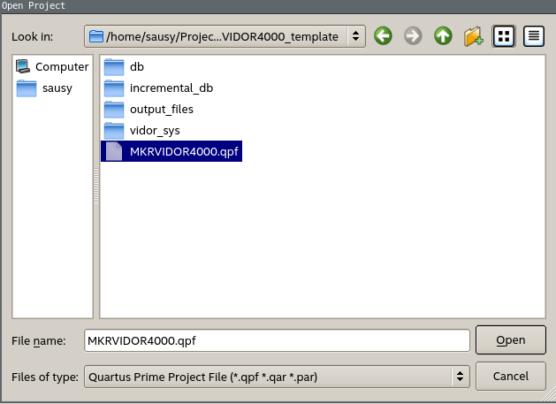
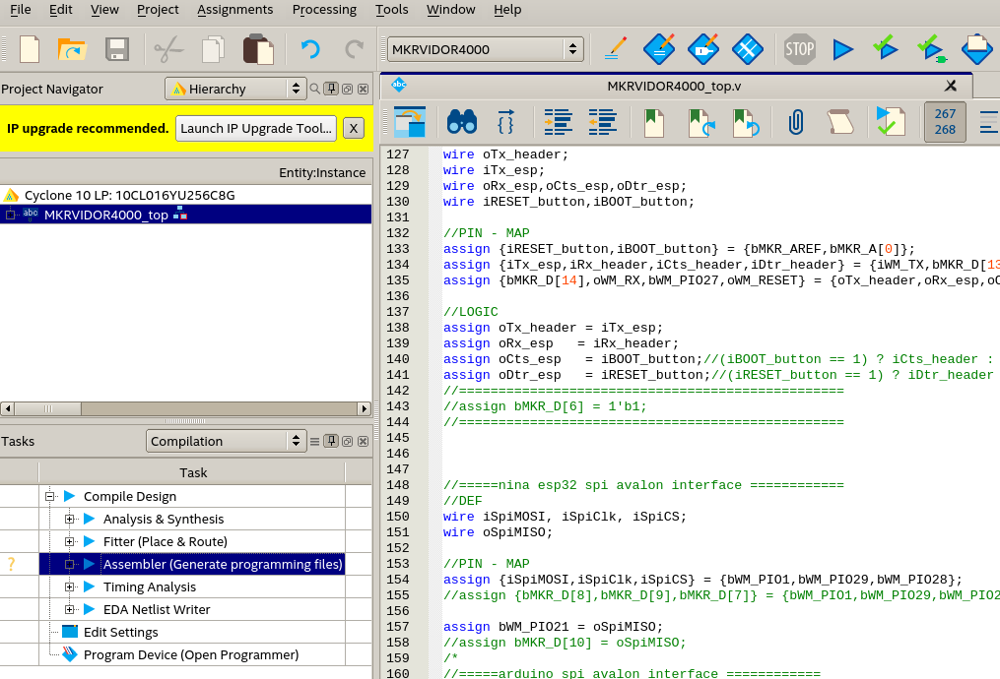
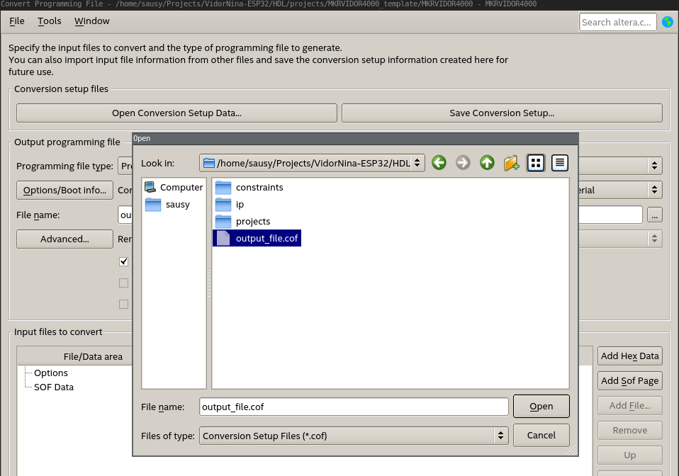
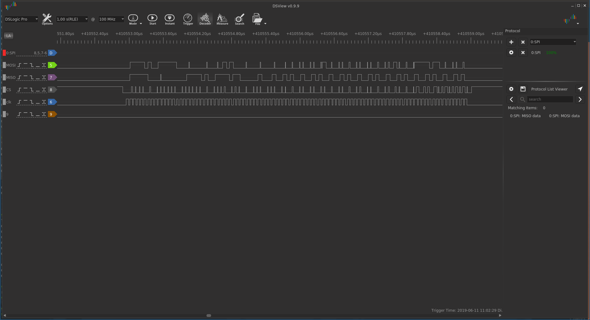

# VidorNina-ESP32
Template to use Vidor 4000k with clean fpga and AVALON Bridge to Nina W-10* 

NOTE FOR Sausi .... TODO: REMOVE MQTT

The aim of this project is to use the power of the nina (esp32) with an clean Cyclon10. 

## Required software
* Quartus 18.1 light (could also work with other Quartus versions >= 17.0 )
* [espressif toolchain](https://docs.espressif.com/projects/esp-idf/en/latest/api-guides/build-system-cmake.html
 "Link to setup tutorial")

## Quartus setup
the following enviroment vars have to be set (could be added to ~/.profile)
```bash
export QSYS_ROOTDIR=~/intelFPGA_lite/18.1/quartus/sopc_builder/bin
export QUARTUS_ROOTDIR=~/intelFPGA_lite/18.1/quartus/
```

## Espressif setup
the following enviroment vars have to be set (could be added to ~/.profile) 
```bash
export IDF_PATH=~/esp/esp-idf
export PATH="$IDF_PATH/tools:$PATH"
export PATH=$PATH:$HOME/esp/xtensa-esp32-elf/bin
```

## HOW TO COMPILE 
### Gen FPGA *.ttf File
Open the Quartus Project  


If you only want to compile it without creating sim data doubleclick 


Converter to *.ttf <File> >> <Convert Programming Files>
open the "output_file.cof" file  


! AND DON't FORGET TO PRESS GENERATE 

### Gen app.h Arduino lib
Open a Terminal change in to the project folder and 
```bash
cd software/vidorSAM
java ReverseByte outputfile.ttf app.h 
```
the java script was provided by a private person that has some nice intro to FPGA development on the Vidor
https://systemes-embarques.fr/wp/telechargement/
the script basicly just inverts the bitstream, because Quartus generats it the wronge way around

### Programm the FPGA and SAM core
just open the Arduino IDE and Flash programm the vidorSAM.ino onto the vidor

### Compile/Programm Nina-Esp32
This part is planed to be simplified in the future, to just add the bitstream to the vidorSAM.ino Project like the FPGA bitstream. But for now a few steps have to be taken to programm it. 

## Hardware setup
Whats needed 
* usb to serial converter
* breakoutboard (just needed for the two buttons, this could also be done via two resistors and two wires)

NOTE FOR Sausi .... TODO: add Pictures

## Compile the esp32 code
Open a Terminal change in to the project folder and 
```bash
cd software/nina
make flash
```


# CODE explanation
## FPGA to NINA
The FPGA code originates from https://github.com/vidor-libraries/VidorFPGA which is the official Arduino Repo

To programm NINA the UART pins have to be tunneled through the fpga to the vidor pinout. To do that add the HDL code 

```verilog
//=====nina esp32 programm interface===============
//DEF
wire iRx_header,iCts_header,iDtr_header;
wire oTx_header;
wire iTx_esp;
wire oRx_esp,oCts_esp,oDtr_esp;
wire iRESET_button,iBOOT_button;

//PIN - MAP
assign {iRESET_button,iBOOT_button} = {bMKR_AREF,bMKR_A[0]};
assign {iTx_esp,iRx_header,iCts_header,iDtr_header} = {iWM_TX,bMKR_D[13:11]};
assign {bMKR_D[14],oWM_RX,bWM_PIO27,oWM_RESET} = {oTx_header,oRx_esp,oCts_esp,oDtr_esp};

//LOGIC
assign oTx_header = iTx_esp;
assign oRx_esp   = iRx_header;
assign oCts_esp   = iBOOT_button;//(iBOOT_button == 1) ? iCts_header : 1'b0;
assign oDtr_esp   = iRESET_button;//(iRESET_button == 1) ? iDtr_header : 1'b0;
//=================================================
```

## SPI AVALON bridge between FPGA and NINA
This one was a bit tricky to implement, first of all the payload convert code was taken from the official IP CORE ("SPI Slave to Avalon Master Bridge Intel") that can be found in "~/intelFPGA_lite/18.1/ip/altera/sopc_builder_ip/altera_avalon_spislave_to_avalonmm_bridge/Drivers/"



### AVALON Explained
TODO: finish docu

after adjusting it to the needs of the esp32, 

```cpp
ret_read = mySPI.transaction_channel_read((i<<10),1, &read_buffer[0],INCREMENT_ADDRESS);
```


